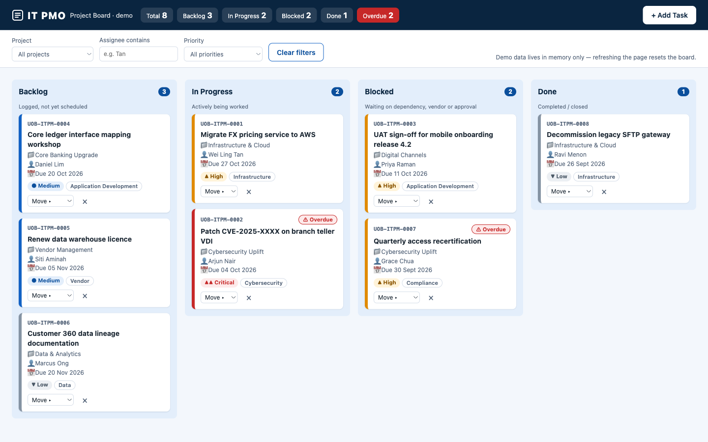
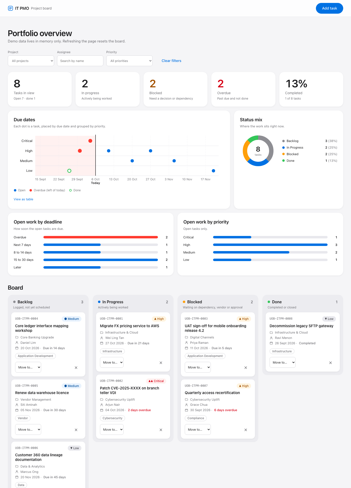

# IT PMO Kanban Board

IT PMO Kanban board demo for a fictitious bank, built as a single vanilla HTML/CSS/JS file.


**Live demo (v1):** https://patwik-gh.github.io/Claude_Demo/
**Live demo (v2, dashboard redesign):** https://patwik-gh.github.io/Claude_Demo/v2/



## v2: dashboard redesign

`v2/index.html` is a redesign published next to v1 (v1 at the site root is unchanged). It keeps the same board behaviour and adds:

- A simpler, Apple-style look: neutral greys and white, one blue accent, red only for overdue.
- A dashboard above the board: KPI tiles, a due-date timeline (dots placed by due date and grouped by priority, with a "today" line and an overdue zone), a status donut, and bars for open work by deadline and by priority. Everything follows the filters, and the timeline has a "View as table" fallback.
- Security hardening: Content Security Policy limiting connections to formsubmit.co, input sanitising (control and bidi characters stripped), strict allow-list validation, endpoint check before any request, no cookies or referrer, a honeypot field, a 5-per-minute submit limit and a 200-task cap.



## Features (v1)

- Four columns: Backlog, In Progress, Blocked, Done.
- Add tasks through a dialog; each task gets an ID with the `UOB-ITPM-####` prefix.
- Move cards by drag and drop or with the "Move ▸" select on each card.
- Inline "Delete? Yes/No" confirmation (no browser dialogs); toast notifications.
- Filter by project, assignee and priority; summary of the board.
- Overdue highlighting based on due dates; seed data due dates are offsets from today.
- Fixed lists for projects, categories (Application Development, Infrastructure, Cybersecurity, Data, Compliance, Vendor) and priorities (Critical, High, Medium, Low).
- Email notification on new tasks via FormSubmit; failure only shows a warning toast and never breaks the board.

## Run locally

Open `index.html` in a browser. No build step and no server needed.

## Technical constraints

- Vanilla HTML/CSS/JS only: no frameworks, bundlers, npm, CDN scripts, web fonts or image files.
- No persistence (no localStorage, sessionStorage, IndexedDB or cookies); a refresh resets to seed data.
- Backend is FormSubmit's AJAX endpoint only. `FORMSUBMIT_ENDPOINT` at the top of the script ships with a placeholder address (`YOUR_EMAIL@example.com`), so the notification fails by design until it is replaced. FormSubmit requires a one-time activation: the first submission sends a confirmation email, and notifications are delivered only after its link is clicked.

## Project structure

```
index.html   v1: markup, styles and script (all inline)
v2/index.html   v2: dashboard redesign (all inline)
CLAUDE.md    Guidance for Claude Code
docs/screenshot.png, docs/screenshot-v2.png   README screenshots (not part of the deployed site)
.github/workflows/ci.yml   CI checks and GitHub Pages deployment
```

## Disclaimer

This is a demo for a fictitious bank. It uses no real logos or branding; the header is a neutral "IT PMO" wordmark.
